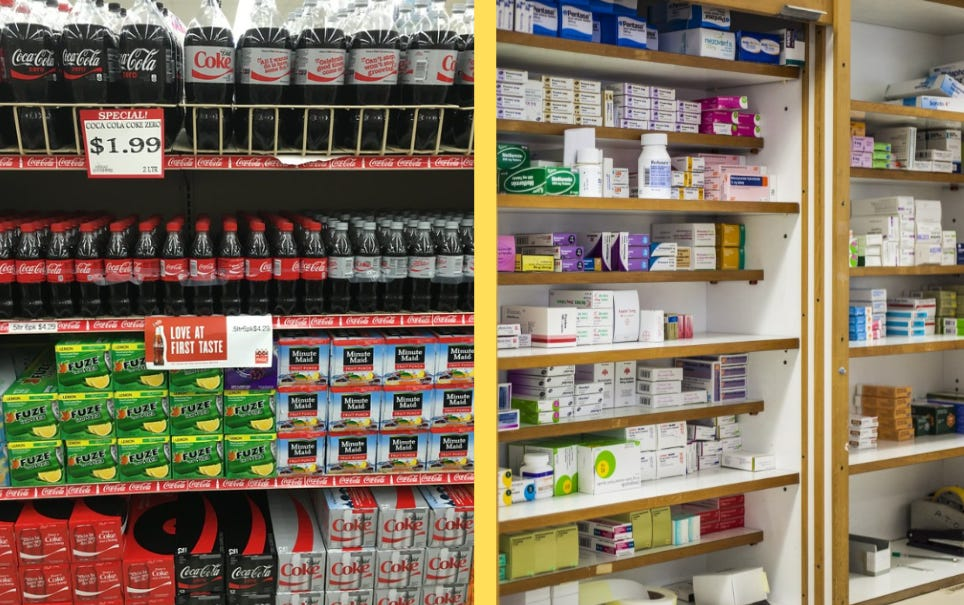
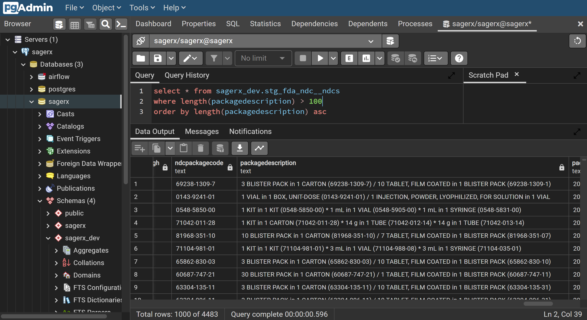

It's weirdly hard to know how much drug product is inside a given drug package. We dive into why it's challenging and how we plan to make it a lot easier.

Just like you can buy different package sizes of, say, pop at the grocery store (yes - I call it pop - I'm originally from the Midwest), pharmacies can also stock different package sizes of drugs. Just like pop comes in 12 or 24 packs of 12 oz cans and also single 20 oz or 2 liter bottles, drug products can come in varying package sizes. The same oral solid drug product from the same manufacturer could be available in say 100, 500, and 1000 count bottles. The same vaccine from the same manufacturer can come in multi-dose 5 mL vials, or pre-filled 0.5 mL syringes - each with perhaps the option of buying a 1 or 10 pack.


<!-- truncate -->

If you wanted to compare the price of pop between package sizes, the best way would be to convert each package to the lowest common unit - let's say ounces. So the 12 pack has 144 total ounces, the 24 pack has 288 total ounces, the 20 oz bottle has 20 ounces (duh), and the 2 liter bottle has ([consults Google](https://www.google.com/search?q=2+L+to+oz)…) 67.628 ounces. Our oral solid product example is pretty straightforward aside from converting the specific "tablet" units to a more generic "eaches" unit - the 100 tablet bottle is 100 "eaches", the 500 tablet bottle is 500 "eaches", etc. For our vaccine example, the total package size of a 10 pack of 5 mL multi-dose vials is 50 mL, and the total package size of a 10 pack of 0.5 mL pre-filled syringes is 5 mL.

## I get it - so what's the problem?

The problem is that this drug packaging information is not easily available in machine-readable format. There's not a simple source of information that provides the total amount of a drug product contained within a drug package. The closest you can easily get is a semi-structured, free-text description of the packaging from FDA's NDC Directory. Example below:

```
1 VIAL, MULTI-DOSE in 1 CARTON (70461-554-10) / 5 mL in 1 VIAL, MULTI-DOSE (70461-554-11)
```

Ideally, we would be able to break this up into discrete columns of data instead of one blob of text. We could have some sort of column for the outer package description (CARTON), a column for the inner package description (VIAL, MULTI-DOSE) and then maybe columns for the total quantity of inner packages (1), the total amount in each inner package (5), and the dose unit of the inner package (ML).



The problem that makes this a lot more complicated is that drug packaging can get pretty complex pretty quickly. Another (more complex) example below:

```
1 KIT in 1 CARTON (80425-0348-1) * .9 mL in 1 PACKET (67777-419-02) * 10 mL in 1 VIAL, PLASTIC (0409-4887-17) * 10 mL in 1 VIAL, SINGLE-DOSE (0409-4888-02) * 5 mL in 1 POUCH * 10 mL in 1 VIAL, SINGLE-DOSE (0409-1159-18) * 10 VIAL, SINGLE-DOSE in 1 CARTON (55150-162-05) / 5 mL in 1 VIAL, SINGLE-DOSE * 25 VIAL, SINGLE-DOSE in 1 CARTON (70121-1573-5) / 1 mL in 1 VIAL, SINGLE-DOSE
```

Additionally, total package size for billing purposes needs to align with the NCPCP Billing Unit Standard Implementation Guide - you can see examples in section 5 (page 11) of [this old version](https://assets.hcca-info.org/Portals/0/PDFs/Resources/library/Billing%20Unit%20Guide.pdf) of the guide. This is a bridge we will have to cross eventually, but it's hard enough to just extract fundamental packaging information from drug products without even worrying about standards like this.

## Why would someone need drug package size information?

Off the top of my head, I can think of at least 3 good examples where I've come across a need for discrete drug packaging information. These are all solved by commercial drug information databases, but not easy to solve with freely available drug data.

### Drug pricing

NADAC provides a "per unit" (EA / GM / ML - same as the [NCPCP Billing Unit Standard](https://standards.ncpdp.org/Standards/media/pdf/BUS_fact_sheet.pdf)) price that most pharmacies pay for a given drug product. If you wanted to know how much an entire package costs, you need to know how many total EA / GM / ML are contained within the package - again following the NCPDP BUS implementation conventions.

### Drug equivalency

If you're a pharmacy browsing a catalog for vaccines to purchase, and only want to see vaccines that come in a multi-pack, whatever purchasing platform you're using needs to have discrete data about their drug products that includes package quantity (i.e. 10 vials in a package vs 1 vial in a package). Entire proprietary coding systems (GPPC, for instance) exist just to compare equivalent drug products by package size or package type.

### Basic drug information

If you're building a system that displays package-level (or NDC-level) information about drugs, you will need to include pack size info in the description of the drug name — otherwise drug products with multiple pack sizes will be indistinguishable by name alone. Also, you will likely need a column that lists the total package size or some sort of sortable or filterable number.

## Our goal is to solve this problem with our next data mart

I've seen this challenge as a major milestone of my work for as long as CodeRx has been around. I've always been aware of where to start, but knew that if I dipped my toe in, I would have to be prepared to dive in completely to really solve the problem. I think I'm ready to jump in head first now.

The other important thing this packaging data has the potential to unlock is a mapping of inner to outer NDCs. In the first example from the previous section, the outer package (the CARTON) has an NDC of 70461-554-10 while the inner package (the VIAL, MULTI-DOSE) has an NDC of 70461-554-11. Pharmacies purchase the OUTER NDC (the carton), but sometimes want to know details about the INNER NDC (the vial) - such as what the label looks like or how much drug it contains.

Our existing [data marts](https://coderx.io/data-marts) are available for download as CSV files via AWS s3 buckets — this one would work the same way. Alternatively, you can use [SageRx](https://coderx.io/sagerx) (our open-source drug data pipeline platform) to generate them for yourself.

**I'm aiming to have something to show for this data mart in the next month or two.**

* If you would like to be notified when this data mart becomes available, please [join our waitlist](https://forms.gle/dwvoyyvsUKLehL5CA) and we'll reach out as soon as it's ready.
* If you want to help develop this, please [join our Slack](https://join.slack.com/t/coderx/shared_invite/zt-5b8e9kr4-PsKAVe4crGmECQyyxDIJgQ) and introduce yourself.
* If you had other questions or feedback, please don't hesitate to [contact us](https://coderx.io/contact-us).

[Join data mart waitlist](https://forms.gle/dwvoyyvsUKLehL5CA)

I'll be writing about our progress toward building this data mart, along with some actual sample data. Please subscribe if you haven't already, and I would greatly appreciate if you would share this article with someone you think would find it useful. Thanks!
