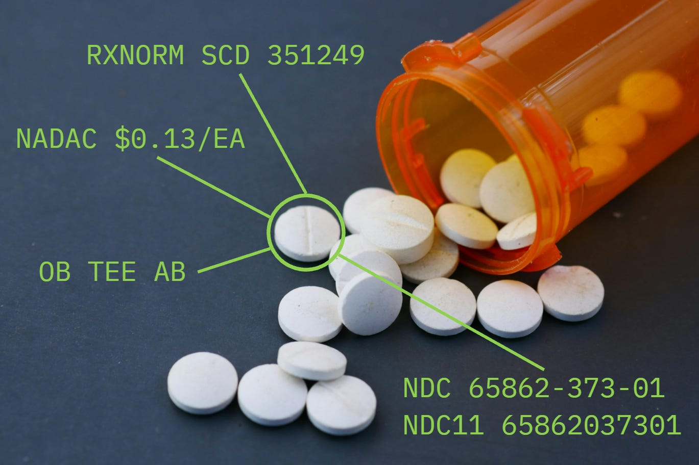

More than you might think...

Open drug data is a powerful resource for healthcare, pharmacy, and research professionals. While it has some gaps, it serves as a foundation for innovation, providing key insights without the barriers of proprietary systems. With the right tools to fill in these gaps, open drug data can rival — and even surpass — commercial databases in accessibility, interoperability, and fostering innovation.

<!-- truncate -->

In this article, we explore the value of open drug data and how it helps answer critical questions with drug information.

## What is this drug product?

One of the core strengths of open drug data is its ability to identify and classify drug products accurately. A prime example of this is **RxNorm**, an open standard maintained by the National Library of Medicine. RxNorm's structured data includes:

* **SCD (Semantic Clinical Drug)**: Clinical drug descriptions, such as "Atorvastatin 10 mg Oral Tablet."
* **SBD (Semantic Branded Drug)**: Branded drug representations, like "Lipitor 10 mg Oral Tablet."
* **GPCK / BPCK (Generic Pack / Branded Pack)**: Packaged drug groupings, such as a "14-count blister pack of Omeprazole."

These term types make it easy to understand what a drug is, its components, and how it might be grouped or packaged. The use of standardized terminology in open drug data ensures that users are not locked into proprietary formats, allowing for easier integration across systems.

## How is it available?

Another question open drug data addresses is: how is this drug available to purchase? Is it available as an injectable product? Does it come as a 100-count bottle? A 1000-count bottle?

The **NDC (National Drug Code) directory** is a robust source of information for current drug products on the market. For those who need historical insights — such as discontinued drugs — **RxNorm Historical** via RxClass provides a more complete picture.

Additionally, details like **pack size** — whether a drug is sold in a 1000-count bottle versus a 100-count bottle — can have significant implications for purchasing and cost analysis. Open drug data offers many of these details, although it may require some effort to extract and utilize them fully.

## What does it cost?

Pricing is a critical question in the world of drug data, and open resources provide important tools for understanding this aspect. While open drug data does not include **AWP (Average Wholesale Price)** — a commonly cited but highly criticized figure for its lack of transparency — it does offer more reliable alternatives, such as:

* **NADAC (National Average Drug Acquisition Cost)**: Reflects the average price paid by retail pharmacies for prescription drugs.
* **ASP (Average Sales Price)**: Used in Medicare Part B reimbursement, showing real-world prices rather than inflated estimates.

These pricing benchmarks are free from the "shell game" often associated with intentionally obfuscated pricing models, giving users a clearer and more trustworthy view of some aspects of drug costs.

## Is it equivalent to anything else?

Determining whether a drug product is equivalent to another is essential in clinical and regulatory settings. Open drug data excels in this area with resources such as:

* **Orange Book**: Published by the FDA, this resource lists therapeutic equivalence evaluations, enabling users to identify generic alternatives for branded drugs.
* **RxNorm product codes**: These standardized identifiers make it easy to link drugs across systems, ensuring consistency and clarity.
* **FDA pack size information**: Details about packaging and dose form help ensure accurate comparisons, such as whether two products with the same active ingredient are sold in equivalent pack sizes.

These tools empower users to assess equivalencies effectively without relying on proprietary systems.

## Closing the gaps

While open drug data provides a strong foundation, there are areas where it can fall short. This is where innovative solutions step in to bridge the gaps. By enhancing open data with features like:

* **Improved accessibility**: Making the data easier to access and use for all stakeholders.
* **Interoperability**: Ensuring seamless integration across systems and platforms.
* **Innovation potential**: Leveraging open data to power new tools and insights that proprietary systems can't offer.

These enhancements unlock the full value of open drug data, empowering organizations to reduce dependency on costly, restrictive commercial databases while driving progress in the industry.

## Conclusion

Open drug data has tremendous potential to transform how we access and use drug information. By building on its strengths and addressing its gaps, we can create a future where drug data is more accessible, interoperable, and innovative.

If you're looking for ways to maximize the power of open drug data, let's connect — I'd love to help you take the next step!

[Contact us](https://coderx.io/contact-us)
