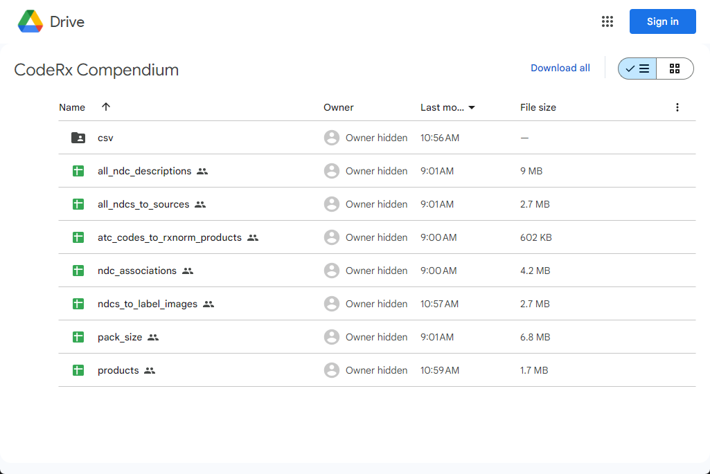

The unfair choice between not easy to use and not easy to afford.

I remember years ago hearing for the first time that in order to know how much drugs cost, people had to pay for a license to a drug information provider. And I don't mean "how much do drugs cost with a GoodRx coupon" — I mean how much does it generally cost a pharmacy to purchase a bottle of a specific medication product.

<!-- truncate -->

To me, that sounded kind of like if you needed to know how much a bottle of Tylenol cost, and your only option was to pay a significant amount of money to a company for a license to a product that provides pricing information. Something just felt bizarre or wrong about the need for people to pay to know what drugs cost.

This may be more of an issue with drug pricing overall (which I will definitely not get into here), but it just left a weird taste in my mouth. In general, I think I took offense to the notion that there should be a price barrier at all for people to have easy access to important information.

More recently, I led a team to develop a piece of software that depended on drug data. When we looked around for options to source that drug data, none of them met all three of our criteria:

1. easy to use off the shelf,
2. well trusted and supported by a community, and
3. within our budget.

Before we could even begin focusing on the potentially innovative part of our project, we had to build a data pipeline from scratch just to create a local database that contained the data we needed.

## Open source exploration

Of course we searched for open-source solutions to our problems as many people in our position would try. Most of the free options were open-source repositories that might tackle one specific problem in a very narrow or brittle way. Many had become stagnant — with years since the last commit to the repo. Few of them made it easy for developers to contribute to the project by extending the open-source framework with their own additional use case or feature. None of them seemed to have a community of people that agree it's a good option as a general source of drug information.

Another thing I was personally stubborn about is that any solution had to be in a modern data language like Python or heavily SQL-centric. Selfishly, these languages are my comfort zone; but I also knew that they are languages that a lot of people know. We may have ruled some useful options out because of this self-imposed limitation.

## Commercial options

Commercial options weren't even a consideration because their price tags were in the tens of thousands of dollars per year. Thinking about this from the perspective of an early stage health tech startup or a pharmacy data analyst or researcher without considerable funding, it feels like a barrier to entry that does not need to be so high.

Pretty much all of what we needed for our project was free for the taking from government-provided data sources — if we could figure out how to work with them. I knew that FDA's NDC Directory and NLM's RxNorm were the two main sources, but didn't have a ton of experience working with either of them. So it seemed like our options were paying a lot of money we didn't have… or starting from scratch.

## Starting from scratch

I assume drug data is not unique in the fact that it's a source of data provided freely by the government that is well-intentioned but not easy to work with. We had to do a decent amount of background research just to figure out which data points come from which data sources. Once we had a grasp on that, we had to figure out how to work with the wide variety of file types and formats.

For us, the first milestone was learning how to re-organize RxNorm from its three oddly named tables into a shape that made common sense to our clinical minds that were used to working with normalized data in relational databases. It meant doing a lot of SQL query writing just to get started, as well as becoming an expert in SABs and TTYs and relationships and attributes. If you've worked with RxNorm before, you may have been through all this yourself.

I want to be clear that I'm not trying to say these tasks are impossible to do, or that we are the first to do them. It just seems just odd that nobody has already packaged this up in a way that most people agree is the right way to essentially reconstitute RxNorm into a more accessible format. We did this for ourselves for our specific software development project, and I guess this is where most work with RxNorm probably ends. In other words, I believe people re-invent the wheel over and over again just to get RxNorm up and working they way they want it to work for a very specific use case. And there's no guarantee that my interpretation of RxNorm is the same as yours.

## The best of all worlds

It seemed like there should be a solution that was cheaper than a commercial database, easier to get started with than using raw data, and had an open source community supporting it. After completing our project for the ONC contest (and winning first prize - no big deal), we set out to build such a thing. Three years later, I think we're getting close. We've built a stable data pipeline to not only pull raw data from all these important sources, but also made it easy to transform the data into useful tables using modern data engineering practices. This is all available right now 100% open source on [GitHub](https://github.com/coderxio/sagerx).

One thing we've struggled with is making our data stupidly easy for people to explore and use. So without overthinking it any longer, **I just loaded all of our currently available data marts to a [Google Drive folder](https://drive.google.com/drive/folders/1dWuEXjno_02sAzkzSJM4IR4DW1Q7smsK)**. I will try to update this on a quarterly basis for free. If you would benefit from more frequent updates or have questions about this, please [contact us](https://coderx.io/contact-us).

[Explore the data](https://drive.google.com/drive/folders/1dWuEXjno_02sAzkzSJM4IR4DW1Q7smsK)

Some useful data marts to call out:

* **products:** all RxNorm products with product-level details such as a brand vs generic flag, ingredients, dose forms, and normalized description
* **all_ndc_descriptions:** NDCs consolidated from five different open sources of drug data, mapped to RxNorm product codes and any available RxNorm or FDA descriptions of the NDC
* **ndcs_to_label_images:** a mapping of DailyMed label images at the NDC level —this is something you can't get from any other open source
* **ndc_associations:** inner-outer NDC packaging associations parsed from the FDA NDC Directory
* **pack_size:** my first attempt at parsing total pack size information from the FDA NDC Directory, including innermost and outermost packaging units

[View all data marts](https://drive.google.com/drive/folders/1dWuEXjno_02sAzkzSJM4IR4DW1Q7smsK)

More documentation about most of these data marts can be found [on our website](https://coderx.io/data-marts). If you have ideas for other data marts or if you find this data useful and would like updated data delivered on a weekly basis, please [contact us](https://coderx.io/contact-us) and we will work with you. Please let us know if you have any questions and thanks for taking the time to read this!
