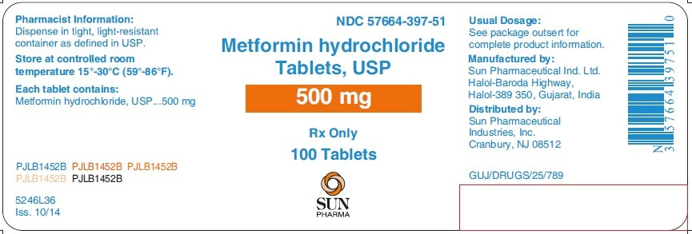
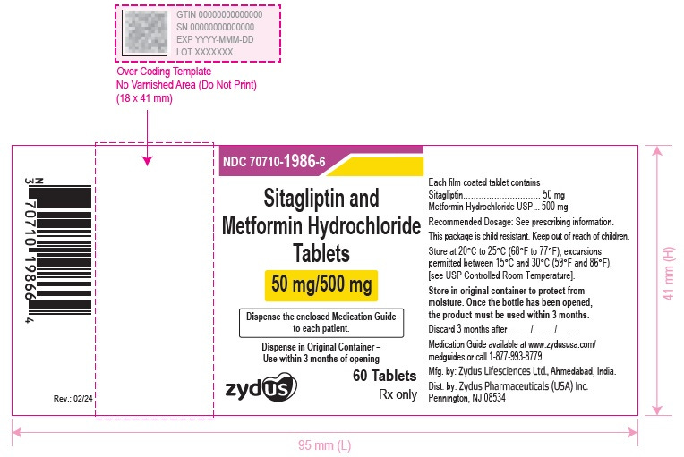
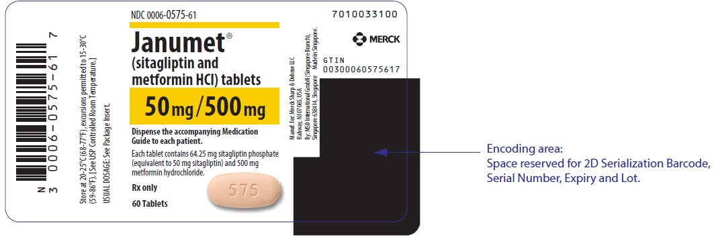
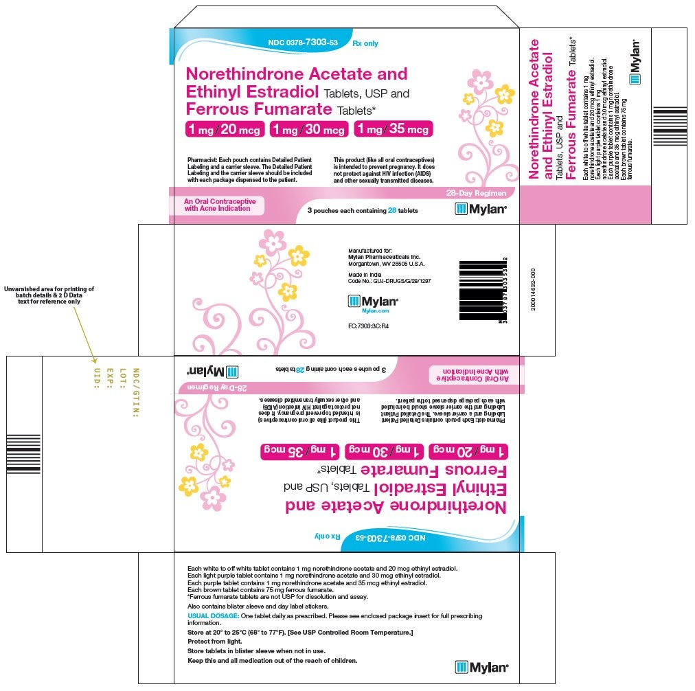
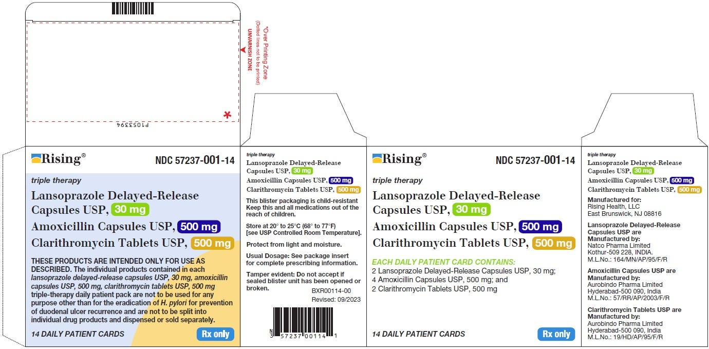
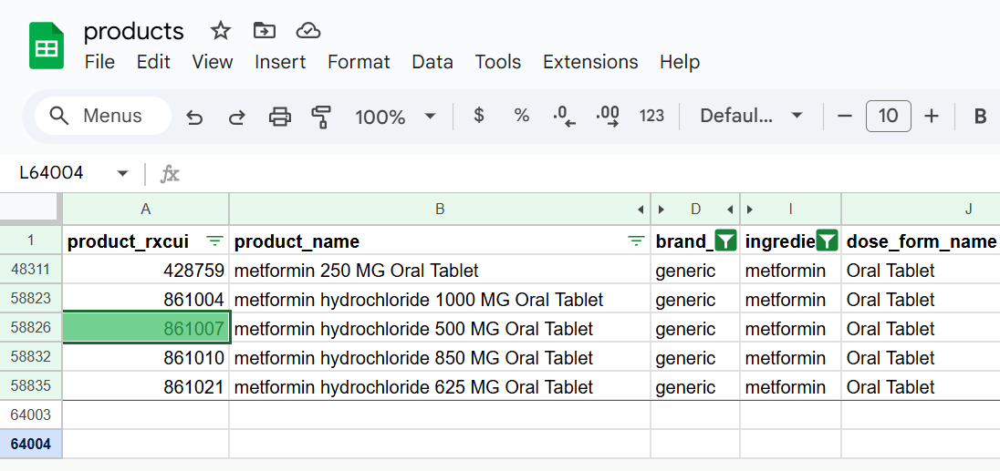
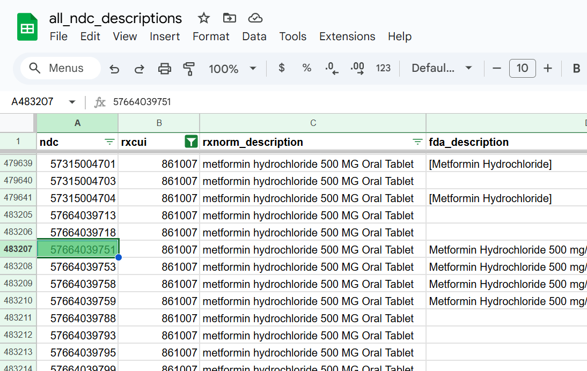

Drug products are a concept foundational to working with drug data in almost any capacity. They are the hub around which many types of analyses pertinent to pharmacy and the medication use process are organized. Drug information databases all have their own proprietary way of working with drug products, but the fundamental concepts are all the same. In this article, we explain those fundamental concepts in plain English and connect them with open standard identifiers.

<!-- truncate -->

## What is a drug product?

The *idea* or *concept* of a drug product requires three things:

1. Ingredient - i.e. metformin
2. Strength - i.e. 500 mg
3. Dose form - i.e. tablet

These are the three essential pieces of information required to hold the idea in your head about a drug product that could be prescribed by a provider or taken by a patient. Lose any one of these data points and you can no longer identify a drug product. A patient can't *take* "metformin 500 mg" or "500 mg tablet" - you need all three parts ("metformin 500 mg tablet").

## Single-ingredient products

The simplest example of a drug product would probably be - you guessed it - metformin 500 mg oral tablet. You can see we have an ingredient (metformin), a strength (500 mg), and a dose form (oral tablet). But as soon as you get out of the realm of simple examples, it can get complicated pretty quickly - as we will see next.

## Multiple-ingredient products

For a slightly more complex example, it's very common for a drug product to have multiple ingredients with different strengths. One example of this is sitagliptin 50 mg / metformin 500 mg oral tablet. This is a single drug *product* with multiple different *ingredients* - which themselves each have different *strengths*.

## Branded products

Another wrinkle is that we need to also account for branded products which can have financial and regulatory / operational implications, but are otherwise the same "clinical drug" behind all that branding. Below is an example of Janumet, which is a branded equivalent to the now generically available sitagliptin / metformin drug product above.

## Packs and kits

We haven't even scratched the surface of the most complex drug products which are known as "packs" or "kits". These are drug products packaged together with OTHER drug products. These are things like oral contraceptives (birth control) where the package you pick up at the pharmacy actually has two separate drug products combined together in a blister pack. Perhaps 21 tablets of one drug product and 7 tablets of another to make up a full 28 day supply.

Packs are different from multiple-ingredient drug products because within the outer saleable package, not all the pills have the same medication in them. Conversely, even though a bottle of a multiple-ingredient drug product has multiple ingredients, all of the pills in the bottle contain the same ingredients.

A kit can be even more complex with perhaps several vials of different drug products combined in one package along with alcohol wipes and sterile water and perhaps other things. We're not going to get into those complex examples here, but dealing with kits is important for any complete understanding of drug products.

## From products to packaging

This is all fine and good, but a patient can't ingest the *idea* or *concept* of a drug product. They have to take an actual, physical medication. The missing pieces needed to go from "product" to "package" are drug manufacturer (who made this drug product) and drug packaging (how this drug product is available for pharmacies to purchase). This is where the National Drug Code (NDC) comes into play.

We aren't going to go in depth into NDCs or drug packaging considerations here because it's enough of a topic for an entirely separate article. However, in all the examples above, you will notice that each label has an NDC on the packaging. Below is an example from the first drug product where the NDC is 57664-397-51.

The NDC is a drug identifier on packaging for drug products. By itself, it is far too specific and not nearly standardized enough to be useful for most analytical purposes. However, mapping the NDC to a drug terminology unlocks a lot of useful things you could do using drug data. For instance, you could aggregate all drug claims by drug product or even drug class. The first step of doing this is mapping NDCs to a drug product *concept* like we reviewed above.

## CodeRx drug product data

We've been developing [CodeRx data marts](https://coderx.io/data-marts) to make it easier to work with drug products. The main data mart relevant to this particular article is aptly named ["products"](https://coderx.io/data-marts/products). We can easily find all generic single-ingredient metformin products with a dose form of tablet. Note that the identifier for our product in question (metformin 500 mg tablet) is 861007. We leverage open standard identifiers from public data sources such as RxNorm wherever possible.

Knowing the product identifier for this specific drug product allows us to use a second data mart to find [all NDCs](https://coderx.io/data-marts/all-ndc-descriptions) that map to that drug product. We found our example NDC (57664-397-51 - or 57664039751 in NDC11 format) in the list as shown below. The fda_description column hints at the fact that we not only look for NDCs in RxNorm - [we also pull NDCs directly from the FDA](https://coderx.io/source-data).

In practice, we would more likely [start with an NDC](https://coderx.io/data-marts/all-ndc-descriptions) and map it to the associated [drug product identifier](https://coderx.io/data-marts/products), but given this article is all about [drug products](https://coderx.io/data-marts/products), it made more sense to do it this way.

> All CodeRx data marts are [available for free](https://coderx.io/data-marts) and updated quarterly.
>
> If you would like more frequent (weekly) updates, [please contact us](https://coderx.io/contact-us).

We invite you to explore our drug product data further. See if you can do a similar exercise as above with the multiple-ingredient drug product or one of the pack examples from the beginning. All CodeRx data marts are [available for free](https://coderx.io/data-marts) and updated quarterly. If you would like more frequent (weekly) updates, [please contact us](https://coderx.io/contact-us).

[View all data marts](https://coderx.io/data-marts)

Drug products are only one foundational aspect of working with drug data. Subscribe and read along as we continue to write about our strange obsession with drug data and how we are making it easier to work with.
