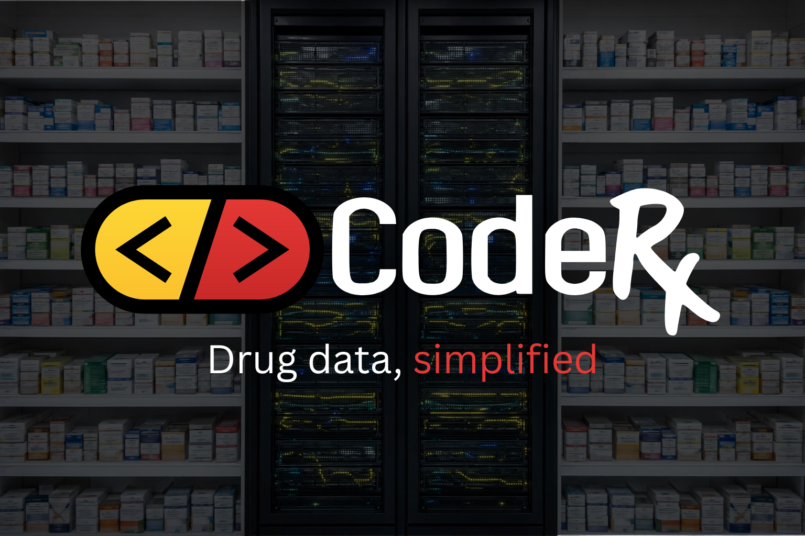
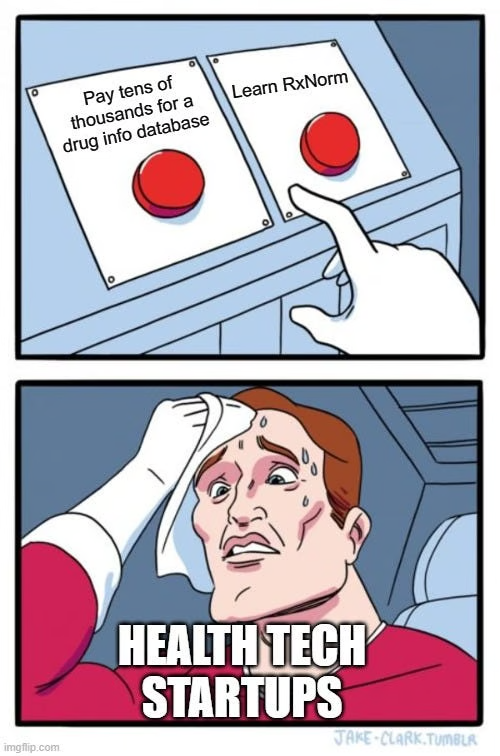

The drug data solution that actually makes sense.

## Why choose between unusable and unaffordable when there's a better way?

For years, anyone building healthcare software, conducting pharmacy research, or analyzing medication data has faced an unfair choice. On one side: free government data that requires months of learning obscure formats, parsing XML from nested zip files, and becoming an expert in RxNorm's abstract table structures. On the other: enterprise drug databases with six-figure price tags and vendor lock-in.

**We built the CodeRx Drug Database because there should be a better choice.**

*Pictured: a server pharm. &lt;/joke&gt;*

## The problem we're solving

Five years ago, when we needed drug data for a healthcare software development project, we discovered what thousands of developers and analysts already knew: there's no middle ground. You either spend months learning to work with raw data sources like RxNorm, FDA, and DailyMed, or you sign a contract that costs more than most early-stage startups can afford.

We chose to build our own data pipeline. We learned the hard way that "open" doesn't mean "easy." We figured out the best way to parse DailyMed's 50,000+ XML files buried in nested zip files. We became fluent in RxNorm's SABs and TTYs. We normalized NDC formats across five different data sources. We automated and enhanced weekly pricing updates from CMS NADAC data.

When our project was complete, we realized something: we had built exactly what the healthcare community needed. Not another GitHub repo that tackles one narrow problem. Not another stagnant open-source project. But a complete, supported, modern drug data product that anyone could use.

## Why the CodeRx Drug Database is different

### Better than raw open data

**You don't need to become a government data format expert.** We've done that part.

Instead of spending weeks learning RxNorm's abstract RXNCONSO, RXNREL, and RXNSAT tables, you get purpose-built data marts like drugs, ingredients, packages, and classes that actually make sense to pharmacists and developers.

No more parsing XML from DailyMed zip files. No more Excel formulas to normalize NDC formats every time you download fresh data from FDA and CMS. No more writing complex SQL joins just to answer basic questions about drug products.

**Setup in minutes, not months.** Browse our open documentation to explore the exact data structure, or subscribe to weekly updates for production use. Either way, you're working with clean, integrated data from day one.

**Documentation built for humans.** Our web-hosted, searchable documentation includes specific use cases with SQL examples. No lengthy PDFs to search through. No generic technical documentation written for data scientists. Just clear explanations focused on pharmacy applications.

*An oldie but a goodie. We finally built a better option.*

### More affordable than proprietary databases

**Costs 90% less than alternatives.** That's not a typo.

For early-stage startups, researchers, and data analysts, enterprise drug databases are simply out of reach. The CodeRx Drug Database costs at least 90% less while providing the core data you actually need.

**Modern integration.** No complex vendor contracting. No legacy data formats. Just straightforward CSV (or Parquet!) files you can load into any modern database or analytics tool.

**Analytics-ready data.** Proprietary databases provide terminology that requires transformation for common use cases. The CodeRx Drug Database gives you semantic drug concepts organized around real-world pharmacy questions — identifying drug classes, calculating days' supply, grouping therapeutics — without writing complex transformations every time.

**Community-driven innovation.** When you have an idea for a new data mart or feature, we can build it together. No waiting for a vendor's product team to add it to their multi-year roadmap.

## What you get

The CodeRx Drug Database includes pre-built data marts that solve real pharmacy problems:

- **Packages**: NDC-to-drug mappings with brand vs generic indicator and pricing data
- **Drugs**: Unified view of brand and clinical products with dose forms, ingredients, and brand relationships
- **Classes**: Multiple classification systems to aggregate drugs by therapeutic class or indication
- **Ingredients**: Detailed ingredient strength information, including precise ingredient classifications
- **Excipients**: Inactive ingredient tracking with special flags for preservatives, dyes, and gluten
- **Synonyms**: Multi-source synonym aggregation for improved search and matching
- **Plus analytics-ready data marts** for common pharmacy use cases

All data is integrated from multiple authoritative sources: FDA - NDC Directory, NLM - RxNorm and DailyMed, CMS - NADAC, and more.

## Who this is for

**Early-stage health tech startups** that need professional drug data without enterprise pricing

**Pharmacy researchers and analysts** who want to focus on insights, not data wrangling

**Healthcare developers** building medication-related features who need reliable, well-structured drug data

**Anyone who's ever thought** "there has to be a better way than learning RxNorm from scratch"

## The best of all worlds

You shouldn't have to choose between spending months learning government data formats and spending six figures on enterprise software. You shouldn't have to reinvent the wheel just to get basic drug information into your application.

The CodeRx Drug Database is the solution we wish existed five years ago. It's affordable, modern, easy to use, and built by pharmacists who code and developers who care about healthcare.

## Get started now

Want to see what we've built? All our documentation is available right now on our website:

[Explore the Docs →](https://coderx.io/docs)

Need weekly updates? Let's talk about a subscription that makes sense for your organization.

[Subscription Options →](/pricing)

Have questions? Shoot us a message or jump into the CodeRx Slack and we will help answer them.

[Contact Us →](https://coderx.io/contact-us)
