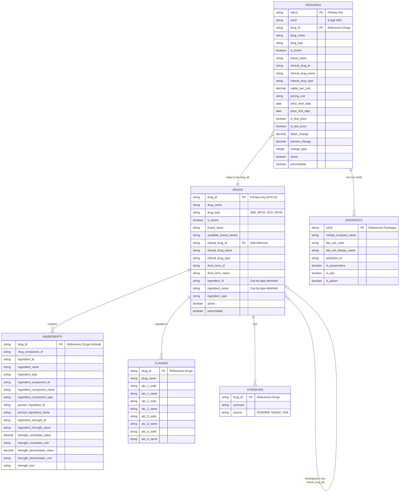

# Entity Relationship Diagram

This diagram illustrates the relationships between the core concepts in the CodeRx data model.

## Relationship Details

### Packages to Drugs
- **Type**: Many-to-One
- **Key**: `packages.drug_id` → `drugs.drug_id`
- **Description**: Multiple NDC packages can map to the same drug product. A drug may have many package sizes and configurations.

### Packages to Excipients
- **Type**: One-to-Many
- **Key**: `packages.ndc9` → `excipients.ndc9`
- **Description**: Each package (at the product level) can have multiple excipients (inactive ingredients).

### Drugs to Ingredients
- **Type**: One-to-Many
- **Key**: `drugs.drug_id` → `ingredients.drug_id`
- **Description**: Each clinical drug product can have multiple active ingredients with detailed strength information.

### Drugs to Classes
- **Type**: One-to-Many
- **Key**: `drugs.drug_id` → `classes.drug_id`
- **Description**: A drug can belong to multiple therapeutic classes across different classification systems (e.g., ATC).

### Drugs to Synonyms
- **Type**: One-to-Many
- **Key**: `drugs.drug_id` → `synonyms.drug_id`
- **Description**: Each drug can have multiple synonyms from various sources (RxNorm, NADAC, FDA).

### Drugs Self-Reference
- **Type**: Many-to-One (Self-referential)
- **Key**: `drugs.clinical_drug_id` → `drugs.drug_id`
- **Description**: Brand drugs reference their generic/clinical equivalents. Clinical drugs reference themselves.

## Key Identifiers

- **NDC11**: 11-digit National Drug Code (unique package identifier)
- **NDC9**: 9-digit NDC (product level, without package code)
- **RXCUI**: RxNorm Concept Unique Identifier (drug product identifier)
- **UNII**: FDA Unique Ingredient Identifier (excipient identifier)

